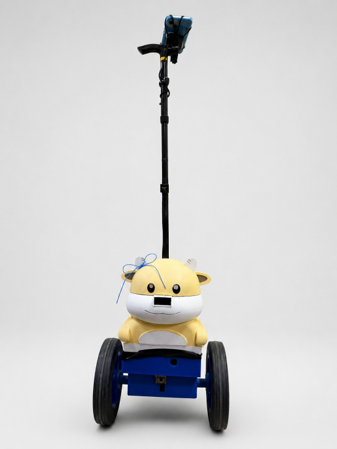

# Navis

### AI 기반 시각장애인 반자율 보행 보조 시스템

> **"길을 알려주는 것을 넘어, 안전한 방향으로 직접 유도하다."**

Navis는 카메라와 센서를 이용하여 보행 환경을 인식하고, 목적지 방향과 주변 상황을 종합적으로 판단하여 **모터의 조향 토크를 통해 사용자의 이동 방향을 직접 유도하는 반자율 보행 보조 시스템**입니다.

특히 횡단보도에서는 횡단보도와 신호등을 인식하고, 횡단 중에도 사용자가 횡단보도를 벗어나지 않도록 지속적으로 좌·우 방향을 보정합니다.

---

## 🚀 Intro

기존의 시각장애인용 보행 보조기기는 장애물이나 주변 환경을 감지한 뒤 **음성 또는 진동을 통해 사용자에게 정보를 전달하는 방식**이 주를 이룹니다.

Navis는 여기에서 한 단계 더 나아가,

**주변 환경 인식 → 상황 판단 → 이동 방향 결정 → 모터 조향**

과정을 하나의 시스템으로 통합하였습니다.

사용자가 장치를 직접 앞으로 이동시키며, 좌·우 모터는 장치를 지속적으로 주행시키는 용도가 아니라 **사용자가 이동해야 할 방향을 직관적으로 느낄 수 있도록 조향 토크를 제공하는 역할**을 수행합니다.

---

## 💡 Inspiration

시각장애인의 보행에서는 단순히 장애물을 발견하는 것뿐만 아니라 **어느 방향으로 이동해야 하는지 판단하는 과정**이 중요합니다.

특히 횡단보도에서는 다음과 같은 어려움이 발생할 수 있습니다.

- 횡단보도의 정확한 위치 파악
- 횡단보도 진입 방향 판단
- 보행 신호 확인
- 횡단 중 직선 방향 유지
- 횡단보도 영역 이탈 방지
- 갑작스러운 전방 장애물 대응

기존 보행 보조기기가 주변 상황을 사용자에게 알려주는 데 집중했다면, 사용자는 전달받은 정보를 다시 해석하고 직접 이동 방향을 결정해야 합니다.

이에 Navis는 **AI Vision, Navigation, Distance Sensor, Motor Steering Guidance**를 결합하여 주변 환경을 인식하는 것에서 그치지 않고 실제 보행 방향까지 보조하는 시스템을 구현하였습니다.

특히 본 프로젝트는 횡단보도를 단순히 객체로 인식하는 것에 그치지 않고,

**횡단보도 인식 → 신호 판단 → 횡단 시작 → 횡단 중 방향 분석 → 좌·우 보정 → 횡단 종료**

까지 하나의 연속적인 보행 과정으로 구현하는 것을 핵심 목표로 합니다.

---

## 🛠 Hardware

<p align="center">
  
</p>

## 📝 Overview

Navis는 크게 **Flutter App, Raspberry Pi, ESP32**의 세 가지 소프트웨어 시스템으로 구성됩니다.

### 📱 Flutter App

사용자의 현재 위치와 목적지를 기반으로 일반 보행 경로를 안내합니다.

- TMAP 기반 목적지 검색
- 보행자 경로 생성
- GPS 기반 현재 위치 확인
- 스마트폰 Compass 기반 현재 진행 방향 측정
- 목표 방위각 계산
- 음성 목적지 입력
- TTS 음성 안내
- ESP32와 BLE 통신
- 장애물 / 횡단보도 / 신호등 상태 표시

### 🍓 Raspberry Pi

카메라 영상을 이용하여 주변 보행 환경을 실시간으로 분석합니다.

- YOLO 기반 객체 인식
- 횡단보도 인식
- 신호등 인식
- 점자블록 및 계단 등 보행환경 객체 인식
- 횡단보도 방향 분석
- 횡단 중 좌·우 보정 방향 결정
- ESP32와 UART 통신

### ⚙️ ESP32

각 시스템의 정보를 실제 모터 동작으로 변환하는 중앙 제어기 역할을 수행합니다.

- Flutter App과 BLE 통신
- Raspberry Pi와 UART 통신
- TFmini 거리 센서 처리
- MDD10A 모터 드라이버 제어
- 일반 길안내 조향
- 횡단보도 조향
- 장애물 감지 및 역토크 경고
- 시스템 제어 우선순위 관리

---

## 🔑 Main Feature

### 1. 목적지 기반 보행 방향 안내

사용자가 Flutter App에서 목적지를 설정하면 TMAP을 이용하여 보행자 경로를 생성합니다.

```text
목적지 입력
    ↓
TMAP POI 검색
    ↓
보행자 경로 생성
    ↓
현재 위치 확인
    ↓
다음 경로점의 목표 방위각 계산
    ↓
스마트폰 현재 방향과 비교
    ↓
LEFT / RIGHT / FORWARD 판단
    ↓
BLE
    ↓
ESP32
    ↓
Motor Steering Torque
```

목표 방향과 현재 진행 방향의 오차를 이용하여 사용자가 이동해야 할 방향을 결정합니다.

Flutter에서 ESP32로 전달되는 주요 명령은 다음과 같습니다.

```text
B:<bearing>   목표 방위각
L:<angle>     왼쪽 방향 유도
R:<angle>     오른쪽 방향 유도
F:<value>     직진 / 중립
S:0           정지
```

---

### 2. AI 기반 보행 환경 인식

Raspberry Pi와 카메라를 이용하여 실시간 보행 환경을 인식합니다.

YOLO 기반 객체 인식 모델을 이용하여 주요 보행 환경 객체를 구분합니다.

주요 인식 대상:

```text
Crosswalk
Traffic Light
Ground Light
Tactile Paving
Stairs
```

카메라 입력 영상은 Raspberry Pi에서 실시간으로 처리되며, 횡단보도가 일정 조건 이상 안정적으로 인식되면 일반 목적지 안내보다 **횡단보도 제어를 우선**합니다.

---

### 3. 횡단보도 우선 제어

Navis의 핵심 기능 중 하나는 횡단보도 상황에서 일반 GPS 경로 안내를 일시적으로 중단하고 **카메라 기반 횡단보도 제어로 전환하는 것**입니다.

```text
Normal Navigation
       ↓
Crosswalk Detection
       ↓
Crosswalk Mode ON
       ↓
Traffic Light Detection
       ↓
Crossing Start
       ↓
Crosswalk Direction Tracking
       ↓
LEFT / RIGHT Correction
       ↓
Crossing End
       ↓
Normal Navigation
```

이를 통해 횡단보도에서는 GPS의 목적지 방향보다 실제 카메라에서 확인되는 횡단보도 위치와 방향을 우선하여 사용자를 유도합니다.

---

### 4. 신호등 인식

Raspberry Pi에서는 YOLO를 통해 신호등 영역을 검출한 뒤 HSV 색상 분석을 이용하여 신호 상태를 판단합니다.

```text
Traffic Light Detection
        ↓
ROI Extraction
        ↓
HSV Color Analysis
        ↓
RED / GREEN
        ↓
Frame Stability Check
        ↓
Traffic Signal Decision
```

신호 상태는 UART를 통해 ESP32로 전달됩니다.

```text
LIGHT:RED
LIGHT:GREEN
LIGHT:NONE
```

빨간불이 확인되면 ESP32는 모터 출력을 정지시키고 안전 상태를 유지합니다.

---

### 5. 횡단 중 방향 보정

횡단이 시작된 이후에도 카메라 영상을 지속적으로 분석합니다.

횡단보도의 위치 및 선 방향을 이용하여 현재 이동 방향이 횡단보도 진행 방향에서 벗어나고 있는지 판단합니다.

```text
Crosswalk ROI
      ↓
Image Processing
      ↓
Canny Edge Detection
      ↓
Hough Line Transform
      ↓
Crosswalk Angle Estimation
      ↓
EMA Filtering
      ↓
LEFT / RIGHT / CENTER
```

Raspberry Pi는 분석 결과에 따라 다음 메시지를 ESP32로 전송합니다.

```text
CROSS_MOTOR:L
CROSS_MOTOR:R
CROSS_MOTOR:CENTER
```

ESP32는 해당 명령에 따라 좌·우 모터에 조향 토크를 발생시킵니다.

```text
CROSS_MOTOR:L
→ Left Steering Torque

CROSS_MOTOR:R
→ Right Steering Torque

CROSS_MOTOR:CENTER
→ Motor Neutral
```

이를 통해 사용자가 횡단 중 횡단보도의 진행 방향을 벗어나지 않도록 지속적으로 보조합니다.

---

### 6. 전방 장애물 감지

TFmini 거리 센서는 장치 전방에 고정되어 장애물과의 거리를 지속적으로 측정합니다.

```text
TFmini
   ↓
Distance Measurement
   ↓
30 cm 이하 3회 연속 감지
   ↓
Obstacle Confirmed
   ↓
Motor Stop
   ↓
Reverse Torque × 3
```

30 cm 이하의 장애물이 연속적으로 감지되면 ESP32는 장애물로 확정하고 양쪽 모터에 **역토크를 3회 발생**시켜 사용자에게 촉각적으로 위험을 전달합니다.

장애물과의 거리가 40 cm 이상으로 증가하면 장애물 상태를 해제합니다.

Flutter App에서는 100 cm 이내의 장애물을 화면에 표시하여 현재 장애물 거리를 확인할 수 있습니다.

---

## 🔄 System Communication

Navis의 전체 데이터 흐름은 다음과 같습니다.

```text
                    ┌─────────────────────┐
                    │    Flutter App      │
                    │                     │
                    │ TMAP / GPS          │
                    │ Compass / Voice     │
                    └──────────┬──────────┘
                               │
                               │ BLE
                               ▼
                    ┌─────────────────────┐
                    │       ESP32         │
                    │                     │
                    │ Central Controller  │
                    │ Motor Control       │
                    │ TFmini Processing   │
                    └──────┬───────┬──────┘
                           │       ▲
                    PWM/DIR│       │UART
                           ▼       │
                       ┌───────┐   │
                       │MDD10A │   │
                       └───┬───┘   │
                           │       │
                           ▼       │
                     Steering      │
                      Motors       │
                                   │
                         ┌─────────┴─────────┐
                         │   Raspberry Pi   │
                         │                  │
                         │ Camera + YOLO    │
                         │ Crosswalk        │
                         │ Traffic Light    │
                         │ Direction        │
                         └──────────────────┘

TFmini ───────── UART ─────────▶ ESP32
```

### Communication Protocol

| Communication | Connection |
|---|---|
| Flutter ↔ ESP32 | BLE |
| Raspberry Pi ↔ ESP32 | UART 115200 bps |
| TFmini → ESP32 | UART 115200 bps |
| ESP32 → MDD10A | PWM / Digital DIR |

---

## 🛡️ Control Priority

여러 입력이 동시에 발생하는 경우 안전 및 보행 상황에 따라 제어 우선순위를 적용합니다.

```text
Obstacle / Safety
        ↓
Traffic Signal
        ↓
Crosswalk Steering
        ↓
Normal Navigation
```

횡단보도 모드에서는 Flutter의 일반 목적지 방향 명령을 제한하고 Raspberry Pi의 횡단보도 방향 판단 결과를 우선적으로 사용합니다.

횡단이 종료되면 다시 Flutter 기반 일반 길안내 모드로 복귀합니다.

---

## ⚙️ Technology Environment

### Embedded


### Computer Vision & AI


### Mobile Application


### Programming Language


### Navigation & Map


### Communication


### Development Environment


---

## 🔧 Hardware

| Hardware | Role |
|---|---|
| Raspberry Pi | AI 영상 처리 및 횡단보도 판단 |
| Camera Module | 실시간 보행환경 영상 입력 |
| ESP32 | 통신 및 전체 제어 |
| MDD10A | 좌·우 DC Motor 제어 |
| DC Motor ×2 | 조향 토크 생성 |
| TFmini | 전방 장애물 거리 측정 |
| Smartphone | 목적지 설정 및 사용자 인터페이스 |
| Battery | 전체 시스템 전원 공급 |

---

## 📂 File Architecture

### SW File Architecture

```text
Navis/
│
├── esp32/
│   ├── README.md
│   └── navis_esp32.ino
│
├── raspberry_pi/
│   ├── README.md
│   └── main.py
│
├── flutter_app/
│   ├── README.md
│   ├── pubspec.yaml
│   └── lib/
│       └── main.dart
│
└── README.md
```

### ESP32

```text
esp32/
├── README.md
└── navis_esp32.ino
```

주요 기능:

- BLE Server
- Flutter 명령 처리
- Raspberry Pi UART 처리
- TFmini 거리 측정
- MDD10A 모터 제어
- 장애물 역토크 경고
- 횡단보도 조향 제어

### Raspberry Pi

```text
raspberry_pi/
├── README.md
└── main.py
```

주요 기능:

- Camera 입력
- YOLO 추론
- 횡단보도 인식
- 신호등 인식
- HSV 신호 색상 판단
- 횡단보도 방향 분석
- ESP32 UART 통신

### Flutter App

```text
flutter_app/
├── README.md
├── pubspec.yaml
└── lib/
    └── main.dart
```

주요 기능:

- TMAP 목적지 검색
- 보행자 경로 생성
- GPS 위치 측정
- Compass 방향 측정
- 목표 방위각 계산
- 음성 목적지 입력
- TTS 안내
- ESP32 BLE 통신
- 시스템 상태 UI 표시

---

## 📡 Communication Protocol

### Raspberry Pi → ESP32

```text
CROSSWALK:1
CROSSWALK:0

LIGHT:RED
LIGHT:GREEN
LIGHT:NONE

CROSSING_START
CROSSING_END

CROSS_MOTOR:L
CROSS_MOTOR:R
CROSS_MOTOR:CENTER
```

### Flutter → ESP32

```text
B:<bearing>
L:<angle>
R:<angle>
F:<value>
S:0
```

### ESP32 → Flutter

```text
DIST:<cm>

OBSTACLE:<cm>
OBSTACLE_CLEAR

CROSSWALK:1
CROSSWALK:0

LIGHT:RED
LIGHT:GREEN
LIGHT:NONE

CROSSING_START
CROSSING_END

CROSS_MOTOR:L
CROSS_MOTOR:R
CROSS_MOTOR:CENTER
```

## 🍓 Raspberry Pi Execution

Main file:

```text
raspberry_pi/main.py
```

주요 Python Package:

```text
ultralytics
opencv-python
numpy
pyserial
picamera2
```

실행:

```bash
python3 main.py
```

AI Model:

```text
best_ncnn_model
```

---

## ⚙️ ESP32 Firmware

Main file:

```text
esp32/navis_esp32.ino
```

ESP32는 Arduino IDE를 이용하여 빌드 및 업로드합니다.

주요 제어값:

```text
BLE Device Name : SMART_CANE
UART Baud Rate  : 115200

Obstacle Detect : 30 cm
Obstacle Reset  : 40 cm

Reverse Torque  : 3 times
```

---

## 🎥 Video

### Demo Video

NAVIS의 주요 기능 및 실제 동작을 확인할 수 있는 시연 영상입니다.

[]([유튜브링크](https://youtu.be/FR7wWThx7Qo?si=4miaAuCFnOR1-boZ))

▶ 이미지를 클릭하면 시연 영상으로 이동합니다.

---

## ✨ Key Differentiation

기존 보행 보조 시스템이 주변 상황을 감지한 후 음성 또는 진동으로 정보를 전달하는 방식에 집중했다면, Navis는 **인식된 주변 환경과 목적지 방향을 바탕으로 사용자가 이동해야 할 방향을 시스템이 판단하고 모터 조향 토크를 통해 직접 전달**합니다.

특히 횡단보도에서는 일반 목적지 경로보다 실제 횡단보도 환경을 우선하여,

```text
횡단보도 인식
      ↓
신호등 판단
      ↓
횡단 시작
      ↓
횡단보도 방향 추정
      ↓
좌·우 조향 보정
      ↓
횡단 종료
```

의 전체 과정을 연속적으로 수행합니다.

이를 통해 단순한 **환경 인식 및 알림**에서 나아가 **상황 판단과 실제 이동 방향 보조까지 수행하는 반자율 보행 보조 시스템**을 구현하였습니다.

---

## 🎯 Project Goal

Navis는 다음 기술을 하나의 시스템으로 통합하는 것을 목표로 합니다.

**AI Vision + Navigation + Sensor + Communication + Motor Steering Guidance**

이를 통해 시각장애인이 목적지까지 이동하는 일반적인 보행 과정뿐만 아니라 횡단보도와 같은 위험도가 높은 보행 환경에서도 보다 직관적으로 이동 방향을 인지할 수 있도록 지원합니다.

---

## 🧑‍🤝‍🧑 Team Member

| **팀원** | **담당 역할** |
|---|---|
| 조혜은 (팀장) | 프로젝트 총괄, ESP32 기반 모터 제어, HW 제작 |
| 조성원 | Raspberry Pi, YOLO 모델 학습 및 영상처리 |
| 이소이 | 센서 데이터 처리, Flutter App UI 구현 |
| 한채원 | 3D 모델링 및 프린팅, HW·회로·하네스 제작 |

---

## 🏆 Embedded Software Contest

This project was developed for an embedded software competition.

**Navis — AI-based Semi-Autonomous Walking Assistance System**
